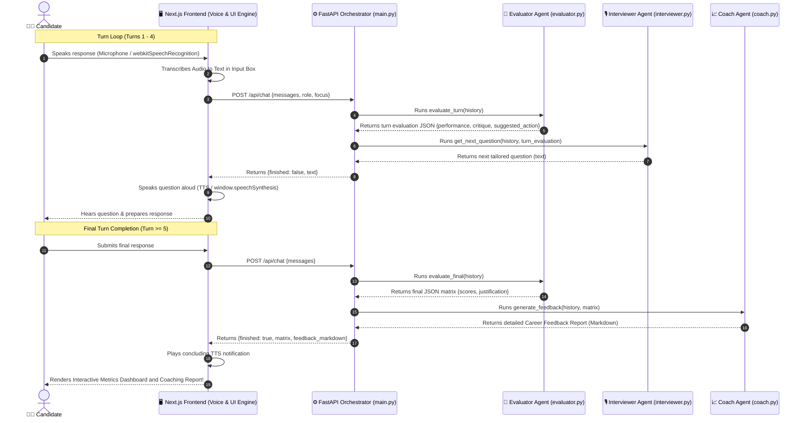

# prep.ai — AI Mock Interview Platform

An AI-first prototype featuring a **3-Agent Multi-Agent System** that runs realistic, adaptive, and highly observant mock interviews for job candidates and delivers structured, high-value coaching feedback at the end. 

### 🎙️ Now with Interactive Browser-Based Voice Support!
This version integrates client-side **Text-to-Speech (TTS)** and **Speech-to-Text (STT / Voice Typing)**. Candidates can hear interviewer questions spoken aloud with customized accents/speed rates, and speak their responses directly using their microphone with zero external API fees or voice subscription keys!

This project is built with **FastAPI** on the backend, **React / Next.js** (App Router) on the frontend, and is powered by **Groq** (using `llama-3.3-70b-versatile`).

---

## 📸 Prototype Screenshots

> **Upload your screenshots here!** Replace the placeholder image links below with actual paths to your screenshots (e.g., `./public/dashboard.png`).

<div align="center">
  
  <p><i>The prep.ai Interactive Dashboard with Voice Controls</i></p>
</div>

<br/>

<div align="center">
  
  <p><i>Detailed Coaching and Evaluation Matrix generated by the multi-agent system</i></p>
</div>

---

## 🚀 Setup & Run Instructions

Ensure you have **Node.js (v18+)** and **Python (3.10+)** installed on your system.

### 1. Backend Setup

1. Navigate to the project root and install the Python dependencies:
   ```bash
   pip install -r requirements.txt
   ```
2. Configure your Groq API Key. Open the `.env` file at the root of the project and set your key:
   ```env
   GROQ_API_KEY=your_groq_api_key_here
   ```
3. Run the FastAPI development server:
   ```bash
   python main.py
   ```
   The backend server will run on `http://127.0.0.1:8000`.

### 2. Frontend Setup (Visual Dashboard)

1. Open a new terminal in the project root and install the Node packages:
   ```bash
   npm install
   ```
2. Start the Next.js development server:
   ```bash
   npm run dev
   ```
3. Open your browser and navigate to `http://localhost:3000` to interact with the visual dashboard.

### 3. CLI Setup (Terminal Interface)

If you prefer to run the interview directly from the command line without launching a web server or browser, use the CLI client:
```bash
python cli.py
```

---

## 🎙️ Interactive Voice & UI Engine (Zero-Cost)

The visual dashboard features direct integration with browser native multimedia services to deliver highly responsive voice interaction without incurring external API latency, setup delays, or dollar costs.

1. **Text-To-Speech (TTS) Interviewer Panel**:
   - Integrated with standard `window.speechSynthesis`.
   - **Auto-Speak Toggle**: Switch on/off automated read-aloud of questions.
   - **Interviewer Accent Dropdown**: Select dynamically from available local and online synthesis voices installed on the host system (e.g. British, US Male, Natural Archetypes).
   - **Pacing Control**: A speed rate range slider (from `0.8x` to `1.5x`) allowing candidates to optimize the interviewer's pace to their preference.
2. **Speech-To-Text (STT) Voice Typing**:
   - Integrated with standard `SpeechRecognition` / `webkitSpeechRecognition`.
   - **Pulsating Microphone Control**: Click the custom microphone icon inside the typing tray to start recording.
   - **Telemetry Waves**: An animated, pulsating glow visual indicator dynamically flashes inside the input tray while recording, giving visual feedback that the system is actively listening.
   - **Auto-stop silence thresholds**: Automatically completes transcription when the candidate pauses or manually stops recording.

---

## 🏛️ Architecture Overview

The system utilizes a 3-agent orchestration pattern coordinated by the backend server `main.py`. Instead of executing prompts in a simple pipeline, the backend runs a **real-time evaluation loop** on each conversational turn to feed context to the interviewer.



### The 3 Agents

1. **Interviewer Agent (`agents/interviewer.py`)**:
   - **Persona**: A seasoned, highly observant hiring manager or lead engineer.
   - **Responsibility**: Welcomes candidates, sets the focus, and asks exactly one clear, targeted question at a time. It uses real-time turn-evaluation critiques to adapt its questions—digging into weaknesses or elevating the difficulty level.
   - **Prompt**: Loaded from [prompts/interviewer_prompt.txt](prompts/interviewer_prompt.txt).

2. **Evaluator Agent (`agents/evaluator.py`)**:
   - **Persona**: An objective, analytical evaluation engine.
   - **Responsibility**:
     - **Turn Evaluation**: Rates the candidate's latest answer (`weak` | `average` | `strong`), provides a brief critique, and recommends a steering action (`probe` | `maintain` | `increase` | `transition`).
     - **Final Transcript Evaluation**: Scores the entire transcript on communication, technical depth, and problem solving (1-10) and writes a concise justification.
   - **Prompt**: Loaded from [prompts/evaluator_prompt.json](prompts/evaluator_prompt.json).

3. **Coach Agent (`agents/coach.py`)**:
   - **Persona**: An elite career and technical mentor.
   - **Responsibility**: Reviews the transcript and the evaluator's score matrix to construct a structured Markdown coaching blueprint including Key Strengths, Performance Gaps, and an Action Plan.
   - **Prompt**: Loaded from [prompts/coach_prompt.md](prompts/coach_prompt.md).

---

## 🛠️ Key Design Decisions & Tradeoffs

### 1. Turn-by-Turn Dynamic Evaluation (Key Decision)
- **Design**: Instead of having the Interviewer evaluate the candidate entirely on its own, the Orchestrator routes the candidate's latest response through the **Evaluator Agent** on *every turn*. The Evaluator returns a small JSON payload summarizing performance and recommending whether to probe further or move on. This is then passed as system instruction context to the **Interviewer Agent**.
- **Tradeoff**: Increases API token usage slightly and increases response latency by running an extra call before generating the next question. However, this decouples evaluation logic from conversational logic, ensuring high persona consistency for the interviewer and highly precise follow-ups.

### 2. Doubled-Curly-Brace Escaping for JSON Schemas (Implementation detail)
- **Design**: To parse prompts dynamically, prompts are loaded from the `prompts/` folder. The `evaluator_prompt.json` holds JSON formats that include raw curly braces.
- **Tradeoff**: Python's string `.format()` treats curly braces as replacement fields. All non-placeholder curly braces in `evaluator_prompt.json` were escaped as `{{` and `}}` to ensure clean runtime string interpolation.

---

## 📝 Example Interview Transcripts

Below are 3 realistic transcripts representing different candidate personas and outcomes.

### 1. Strong Candidate (Frontend Engineer Intern — Technical Focus)

* **Resume Snippet**: Built a React-based task manager with 200+ daily active users. Highly interested in performance optimization and state management.
* **Turns Timeline**:

> **Interviewer**: Welcome to your frontend drill session! Let's start with your React task manager. How did you optimize the performance of that application?
>
> **Candidate**: I identified bottlenecks by profiling the application using Chrome DevTools. I found that typing in task inputs triggered unnecessary re-renders across the entire list. To resolve this, I implemented React.memo on list items, used useCallback to memoize event handlers, and virtualized the list using react-window to handle large datasets of up to 10,000 tasks.
>
> *[Turn Eval: Strong. Specific technical keywords used correctly. Action: Increase difficulty]*
>
> **Interviewer**: Great. Let's dig into list virtualization. How does react-window work under the hood, and how did you ensure state updates (like marking a task complete) are preserved when items scroll out of view?
>
> **Candidate**: react-window works by absolute-positioning a tiny subset of DOM elements and swapping their data as you scroll, rendering only what's in the viewport. For state updates, I maintained state in a parent container component (and later transitioned to Zustand). Because state is stored globally/externally, scrolling an item out of view unmounts the DOM element, but its status is preserved in the Zustand state tree.
>
> *[Turn Eval: Strong. Understands virtualization, viewport absolute positioning, and global state preservation. Action: Increase difficulty]*
>
> **Interviewer**: Excellent. Let's talk real-time collaborative scaling. If you had to build a real-time collaborative feature (like Google Docs) for this task manager, what React state management pattern and networking protocol would you choose, and why?
>
> **Candidate**: I would use WebSockets for low-latency bidirectional communication. To merge concurrent edits without conflicts, I would pair it with Yjs, a Conflict-free Replicated Data Type (CRDT) library. In React, I would manage local UI state normally but wrap the shared document state in a custom hook that synchronizes Yjs document updates with our Zustand store.
>
> *[Turn Eval: Strong. Understands WebSockets, CRDTs, and Yjs hook bindings. Action: Maintain]*
>
> **Interviewer**: That's a highly robust choice. How would you handle network disconnection or packet loss in this collaborative environment without ruining the user experience?
>
> **Candidate**: I would implement optimistic updates so the UI reflects the user's action immediately. If the socket drops, actions are stored in an offline queue. I'd initiate reconnect logic with exponential backoff. Once reconnected, the CRDT document merges state history seamlessly without server-side overrides.
>
> *[Turn Eval: Strong. Optimistic updates, offline queue, exponential backoff, CRDT merge. Action: Maintain]*
>
> **Interviewer**: Final question: how do you measure the success of these performance optimizations in a production environment?
>
> **Candidate**: I would track Core Web Vitals, specifically Interaction to Next Paint (INP) and Largest Contentful Paint (LCP), using a telemetry provider like Sentry. I'd also enforce Lighthouse performance budgets in our CI/CD pipelines to prevent regressions.

* **Final Score Matrix**:
  - **Communication**: 9/10
  - **Technical Depth**: 9/10
  - **Problem Solving**: 9/10
  - **Justification**: "The candidate demonstrated exceptional frontend knowledge, explaining virtualization, real-time networking, and offline synchronization protocols with high precision and clarity."

---

### 2. Weak Candidate (Data Analyst — Behavioral Focus)

* **Resume Snippet**: Entry-level graduate with coursework in statistics. Worked on a group project analyzing retail sales.
* **Turns Timeline**:

> **Interviewer**: Welcome to the behavioral drill. Tell me about a time you had to clean a messy dataset for an analysis and what the outcome was.
>
> **Candidate**: Yeah, in our retail project, the sales data was really messy. Some columns had empty values and some numbers didn't make sense. So I just deleted all the rows with missing values and it was fine after that.
>
> *[Turn Eval: Weak. Evasive, deleted missing values without checking bias. Action: Probe deeper]*
>
> **Interviewer**: Deleting data is one option, but it can introduce significant bias. How did you verify that deleting those missing rows didn't skew your final sales metrics or statistically misrepresent certain products?
>
> **Candidate**: Oh, we didn't really check that. We just needed to make the graphs look nice for the presentation, and since there were only a few rows like that, we figured it wouldn't matter much.
>
> *[Turn Eval: Weak. Lacks understanding of data integrity and statistical bias. Action: Transition]*
>
> **Interviewer**: Let's pivot to the metrics of the retail sales project itself. What statistical methods or metrics did you use to draw conclusions from the dataset, and what did you find?
>
> **Candidate**: We mostly just calculated the average sales per store and made a pie chart of the categories. We found that clothing sold more than electronics in the winter, which makes sense because of jackets.
>
> *[Turn Eval: Weak. Extremely basic analysis, relies on obvious conclusions. Action: Transition]*
>
> **Interviewer**: Pie charts can show proportions, but store sales are often influenced by many variables. If a stakeholder asked you to predict next winter's sales, how would you approach building a regression or forecasting model?
>
> **Candidate**: I haven't really done forecasting before. I guess I would put the sales in Excel and draw a trendline to see where it goes. Or maybe ask someone else who knows Python.
>
> *[Turn Eval: Weak. Unfamiliar with basic regression or forecasting. Action: Transition]*
>
> **Interviewer**: Let's pivot to teamwork. Tell me about a time when you and a team member disagreed on how to analyze data, and how you resolved it.
>
> **Candidate**: We had a disagreement on whether to use a line chart or a bar chart. I wanted a bar chart but they wanted a line chart. We ended up just doing both because we couldn't decide.

* **Final Score Matrix**:
  - **Communication**: 4/10
  - **Technical Depth**: 3/10
  - **Problem Solving**: 3/10
  - **Justification**: "The candidate struggled to articulate statistical methods, dismissed potential biases in data preprocessing, and demonstrated low proficiency in analytical problem solving and communication standards."

---

### 3. Tricky / Edge Case Candidate (Product Manager — Mixed Focus)

* **Resume Snippet**: Former software engineer transitioned to PM. Worked on scaling a database product.
* **Turns Timeline**:

> **Interviewer**: Welcome! Let's jump in. Imagine you are the Product Manager for a new SaaS product, and engineering resources are suddenly cut in half. How do you prioritize features?
>
> **Candidate**: I don't know, it depends on the market. Actually, can you clarify what SaaS product this is? Is it B2B or B2C? Because feature prioritization would vary dramatically based on the target customer profile.
>
> *[Turn Eval: Average. Asks clarifying questions instead of answering. Action: Provide context]*
>
> **Interviewer**: Good call. Let's assume it's a B2B enterprise CRM startup trying to sign its first ten pilot customers. Engineering resources were just halved due to budget cuts. How do you decide what to build?
>
> **Candidate**: Understood. In a B2B CRM startup trying to sign our first 10 pilot clients, achieved product-market fit and unblocking sales is the highest priority. I'd interview the pilots, map their critical workflows, and only build the core integration and contact sync. I would use a simplified RICE scoring model focusing heavily on the 'Must-Have' blocker features.
>
> *[Turn Eval: Strong. Applies PM frameworks under constraints. Action: Increase difficulty]*
>
> **Interviewer**: Your lead architect tells you that the core integration they need requires a complete rewrite of the API layer, which will take 3 months, leaving no time for the contact sync. How do you handle this technical roadblock with the engineering team and the clients?
>
> **Candidate**: First, I would run a technical audit with the architect. Do we need a 'complete rewrite' for the *pilot* stage, or can we build a temporary wrapper API or hardcoded connector to unblock pilots? If we must rewrite, I would negotiate with the clients. Can we do manual CSV uploads for the first month to buy the engineers time for the integration?
>
> *[Turn Eval: Strong. Proactive engineering discussion, proposed temporary connectors (MVP/duct-tape solutions), customer negotiation. Action: Maintain]*
>
> **Interviewer**: That's a highly pragmatic response. Let's say one pilot customer threatens to back out unless they get their custom database sync immediately. How would you handle this pressure from sales and the customer?
>
> **Candidate**: I would look at the lifetime value of this customer. If they represent 80% of our potential pilot revenue, we might pivot. But if they are 1 of 10 equal pilots, I would explain our roadmap constraints. Custom work for single clients is a death sentence for startups. I would offer them a white-glove manual sync run by our team weekly as a workaround.
>
> *[Turn Eval: Strong. Evaluated LTV, stood firm against custom feature creep, offered manual workaround. Action: Maintain]*
>
> **Interviewer**: Finally, the startup CEO steps in and tells you to build that custom sync anyway because the sales rep is his close friend. How do you manage this internal stakeholder conflict?
>
> **Candidate**: I would present the CEO with a cost-benefit analysis. Building the custom sync delays the API rewrite by 2 months, which risks losing the other 9 pilot customers who represent a larger market opportunity. I would suggest we build a generic sync that *looks* custom but is reusable, or align with the CEO on the explicit trade-off of delaying the other launch.

* **Final Score Matrix**:
  - **Communication**: 8/10
  - **Technical Depth**: 8/10
  - **Problem Solving**: 9/10
  - **Justification**: "Candidate handled tricky scenarios with startup pragmatism. They successfully navigated engineering constraints, stakeholder pressure, and business trade-offs."
